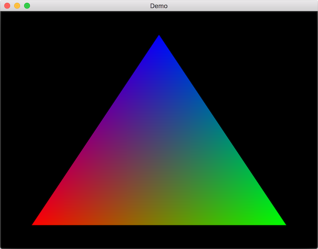

# GLFWDemo-Mac
It is a simple demo of the GLFW for Mac OS X.

### Installation of the library
- sudo port install glfw
- sudo install_name_tool -id /opt/local/lib/libglfw.3.dylib /opt/local/lib/libglfw.3.dylib

### Screen Shot

